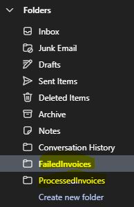
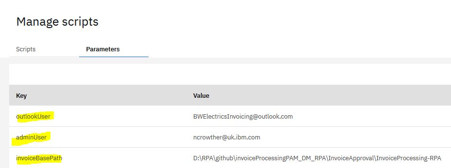
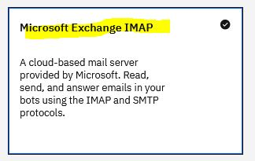
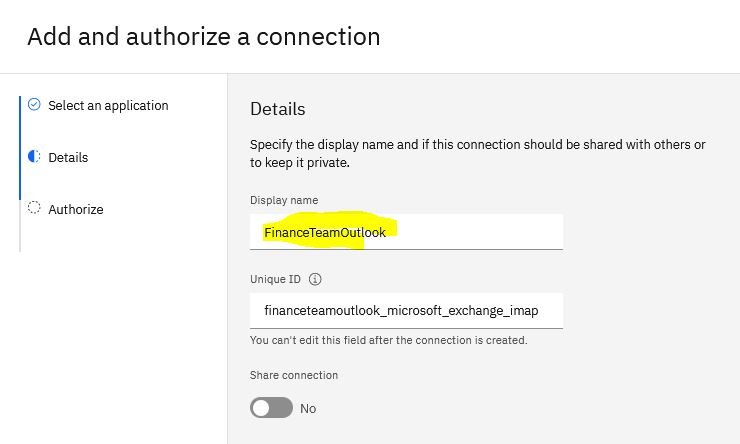

# Invoice Processing Project

This project combines PAM, DM and RPA to provide a complete invoice processing solution for small to medium size enterprises.

## Creating Outlook email folders

Create a free Outlook account (IBM Outlook does not work)

In Outlook, create failed and processed invoices folders:
 
 <p align="center"></p>

## Configuring Outlook in RPA Control Center

Login to the RPA control center. 

Configure the following script parameters:

```
outlookUser - set to your free outlook email address created above
adminUser - set to the email address of the person who will be administering the bot (to start with, this will be you)
invoiceBasePath - set to the base path of this project (the InvoiceProcessing-RPA folder in this project)
```

 <p align="center"></p>

Go to Connections 

Create a new Microsoft Exchange IMAP connection that connects to your Outlook email.   

 <p align="center"></p>

  <p align="center"></p>

## The RPA Bot

Open RPA studio and import the artefacts in folder ```InvoiceProcessing-RPA```

Open ```invoiceBot.wal```. Change line 105 so that it points to the outlook connection you created.

##  The decision service

Open Business Central

Create a project called ```emailClassification```

Import the asset ```invoiceType.dmn```  under folder ```emailClassification-DM```. Build and deploy the model

The DM model should be exposed at the following endpoint:

```
http://localhost:8080/kie-server/services/rest/server/containers/emailClassification_1.0.0-SNAPSHOT/dmn
```

if you are using a different endpoint, you will need to change line 42 of ```DetermineInvoiceTypeDM.wal```

Run ```DetermineInvoiceTypeDM.wal``` to check  the rule service is working

## The Approval Process

Open Business Central

Go to Design

In MySpace, add a project called ```InvoiceApproval```

Import asset InvoiceApproval.bpmn from folder ```invoiceApproval-PAM``` into Business Central.
Import asset ```ApproveInvoice-taskform.frm``` from folder ```invoiceApproval-PAM``` into Business Central. Ensure its name is ```ApproveInvoice-taskform```

 Build and deploy the process

## Test the process

Go to Manage tab and select process definitions. 
Under InvoiceApproval Actions, click start
Enter dummy data and submit
Under Track tab select task inbox
Select the invoice approval task
Click Claim, then click Start button and then click Approved, then click Complete button


If using default ports, the process should be exposed at the following endpoint:

```
http://localhost:8080/kie-server/services/rest/server/containers/InvoiceApproval_1.0.0-SNAPSHOT/processes/InvoiceApproval.InvoiceApproval/instances"
```


## Set PAM endpoint in RPA

if you are using a different endpoint, you will need to change line 37 of ```invokePamApprovalProcess.wal```

Run ```invokePamApprovalProcess.wal``` to check the rule service is working

## Testing the bot

Open ```prepareTest.wal```. Change line 79 so that it points to the outlook connection you created.
To send two sample invoices and test the results, run ```UnitTests.wal```

## Running the bot

To process invoices, run ```InvoiceBot.wal```

## Outlook Error diagnosis:
```
[USER DIR]\AppData\Local\IBM Robotic Process Automation\imap.log
```


